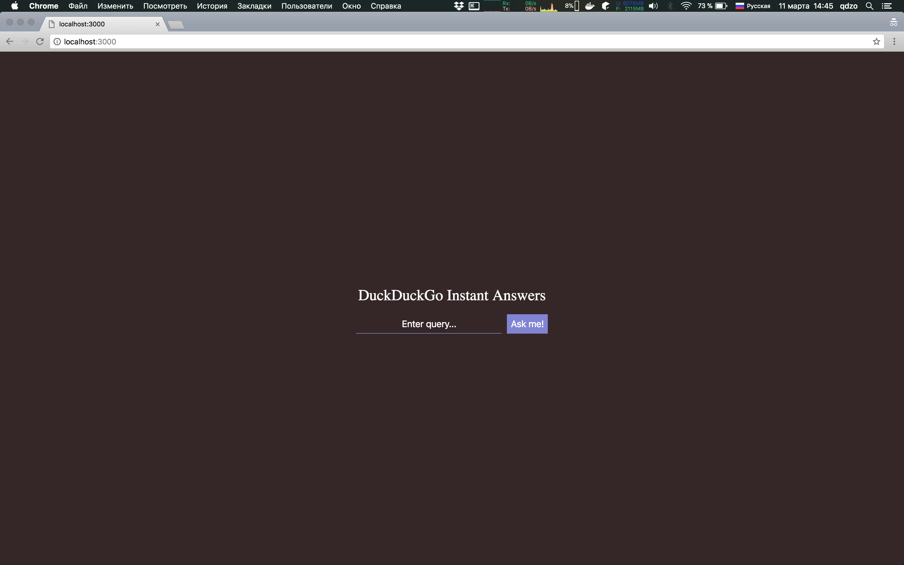
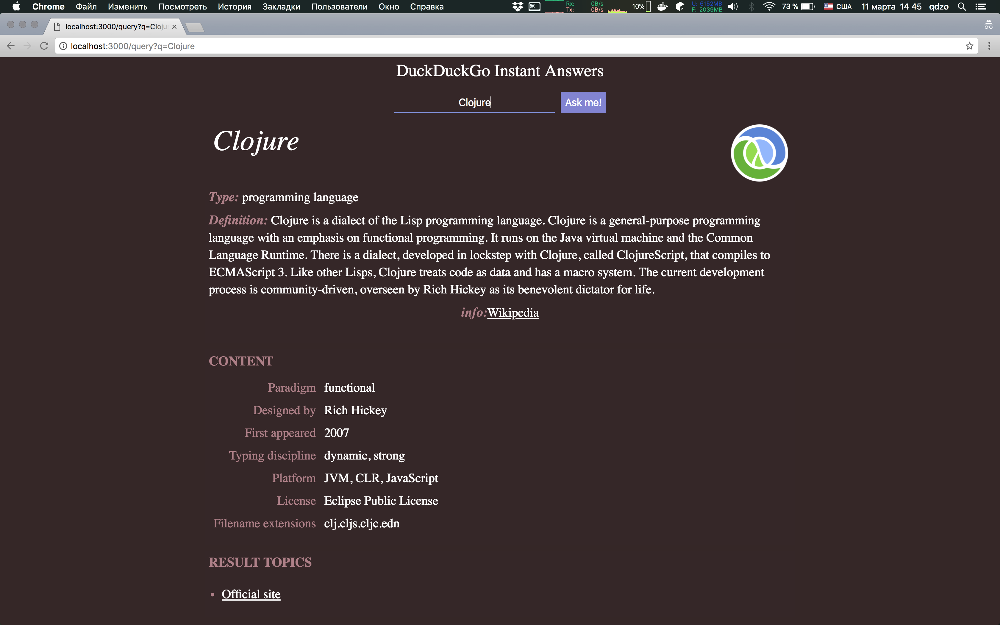
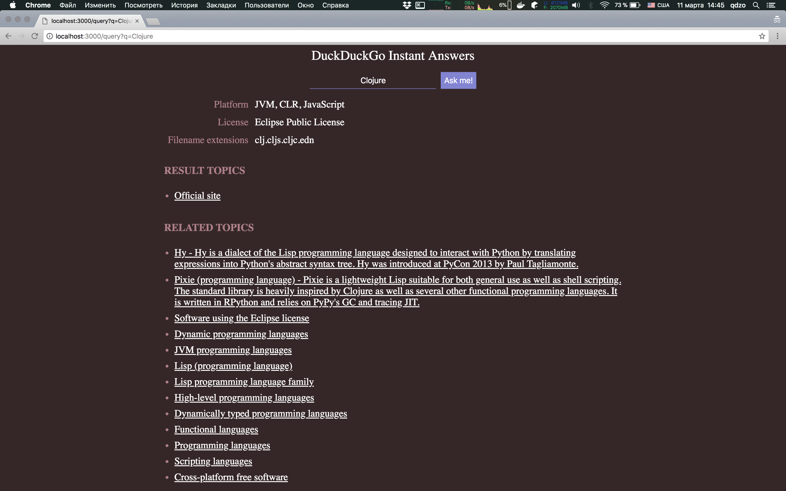

# Duckduckgo-clj

Search-like application, which consumes ["duckduckgo instant answer api"](https://duckduckgo.com/api).
This is a toy-project, which purpose is to test `clojure/clojurescript` alliance as full-stack platform for client-server applications.

## Screenshots

* 
* 
* 

## Requirenments

* [OracleJDK-9](http://www.oracle.com/technetwork/java/javase/downloads/jdk9-downloads-3848520.html) or [OpenJDK-9](http://openjdk.java.net/install/)
* [Leiningen](https://leiningen.org/)

## Usage

### Build project

```bash
git clone https://github.com/qdzo/duckduckgo-clj && cd duckduckgo-clj
lein do cljsbuild once, ring uberjar
```

### Run server

```bash
java -jar target/duckduckgo-clj-$(version)-standalone.jar
```

### Open browser tab

* http://localhost:3000/

## License

License
Distributed under the Eclipse Public License, the same as Clojure.
